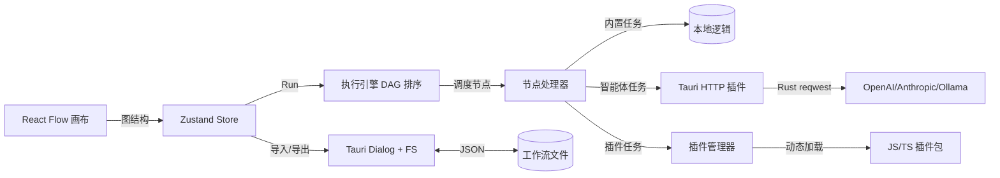

## 用户需求

从零构建一个类 ComfyUI 节点式工作流风格的 Agent 桌面端应用，参考 Typora 默认界面风格，支持以连线方式定义任务拓扑并执行。

## 产品概述

一款基于 Tauri 的桌面应用：用户在画布上拖拽、连接节点组成有向无环图（DAG），每个节点绑定一个可执行任务（内置任务或外部智能体），点击运行后按拓扑顺序逐节点执行并回传数据，支持将整个工作流以 JSON 形式导入导出，并允许用户以 JS/TS 插件包的形式自定义工具节点并动态加载。

## 核心特性

- 节点式可视化编辑器：节点可拖拽、缩放、连线，连线表示数据/控制流向（DAG）
- 多协议智能体节点：支持 OpenAI 兼容、Anthropic、Ollama 本地模型等多种协议的 LLM 接入与对话/生成任务
- 工作流执行引擎：拓扑排序、节点状态可视化（等待/运行/成功/失败）、节点间数据传递
- 工作流导入导出：通过文件对话框读写 JSON 工程文件
- 插件扩展机制：扫描插件目录，动态加载 JS/TS 插件包，注册自定义节点类型与执行逻辑
- Typora 风格界面：浅色、留白、柔和边框、低干扰的简洁编辑体验

## 技术栈选择

- 桌面框架：Tauri 2.x（Rust 后端 + Web 前端），体积与性能优于 Electron
- 前端：React 18 + TypeScript + Vite
- 节点编辑器：@xyflow/react（React Flow），成熟且原生支持自定义节点、连线、缩放平移与画布状态管理
- 状态管理：Zustand，轻量、适合高频画布状态更新，支持细粒度选择器避免重渲染
- 样式：Tailwind CSS + 自定义 CSS 变量实现 Typora 风格主题
- LLM 网络访问：@tauri-apps/plugin-http（请求经 Rust 侧转发），规避浏览器 CORS 限制，统一多协议请求出口
- 文件/插件访问：@tauri-apps/plugin-fs、@tauri-apps/plugin-dialog（导入导出与插件目录扫描）
- 脚本/类型：Rust (reqwest 转发 LLM)，TypeScript (前端与插件)

## 实现方案

整体采用"前端画布 + Rust 侧代理 + 执行引擎"分层架构。用户在 React Flow 画布编辑图，图结构存入 Zustand；点击运行时，执行引擎对图做拓扑排序，按序实例化节点处理器（内置或插件），每个处理器通过 Tauri 命令调用 LLM 或本地逻辑，结果沿边写入下游节点输入；节点状态实时回写画布。

关键技术决策：

1. 选用 React Flow 而非自研画布：连线/拖拽/缩放在成熟库上已验证，避免重复造轮子，且自定义节点 API 契合 Typora 风格 UI。
2. LLM 调用统一走 Tauri http 插件而非前端 fetch：避免 CORS 与密钥暴露风险，便于后续增加流式响应。
3. 插件加载采用"清单 + 模块"方式：每个插件文件夹含 manifest.json（节点元数据）与 index.js（execute 函数），通过读取文件内容生成 Blob URL 后 `import()` 动态加载，并向插件注入受限 ctx（日志、LLM 客户端、存储），降低沙箱复杂度同时保证可扩展性。

性能与可靠性：

- 拓扑排序复杂度 O(V+E)，仅在图变更时重算并缓存。
- 执行引擎对独立分支可并行调度（Promise.all），受 I/O（LLM 延迟）主导，瓶颈在网络而非 CPU。
- 画布使用 Zustand 选择器，节点状态更新只触发单个节点组件重渲染，避免整图重绘。
- 插件加载结果缓存，不每次运行扫描文件系统。

## 实现注意事项

- 复用 Rust 侧单一 HTTP 转发命令处理所有协议差异（在 JSON 入参中携带 protocol 字段），避免为每个厂商写独立命令。
- LLM 调用失败需返回结构化错误并标记节点失败态，不中断整图（提供"失败即停"开关）。
- 插件 execute 异常需被捕获并隔离，防止单个插件崩溃影响主应用。
- 日志使用现有 console + 可选 Rust 写文件，避免打印完整请求体（含 apiKey）。
- 导入工作流时校验 schema 版本与节点类型是否存在，缺失类型给出占位提示，保证向后兼容。

## 架构设计



## 目录结构

```
slimeMold/
├── src-tauri/                       # [MODIFY] Tauri Rust 后端
│   ├── src/
│   │   ├── lib.rs                   # [MODIFY] 注册命令与插件
│   │   ├── llm.rs                   # [NEW] 统一 LLM 转发命令（多协议），基于 reqwest
│   │   ├── plugins.rs               # [NEW] 插件目录扫描与文件读取命令
│   │   └── workflow_io.rs           # [NEW] 工作流文件读写（配合 dialog）
│   ├── Cargo.toml                   # [MODIFY] 添加 tauri-plugin-http/fs/dialog 依赖
│   ├── tauri.conf.json              # [MODIFY] 窗口/权限/插件配置
│   └── capabilities/default.json    # [MODIFY] 声明所需插件权限
├── src/                             # [MODIFY] React 前端
│   ├── main.tsx                     # [MODIFY] 应用入口
│   ├── App.tsx                      # [MODIFY] 整体布局（画布+侧栏+菜单）
│   ├── styles/typora.css            # [NEW] Typora 风格主题变量与基础样式
│   ├── canvas/
│   │   ├── WorkflowEditor.tsx       # [NEW] React Flow 画布容器与交互
│   │   └── nodes/BaseNode.tsx       # [NEW] 统一节点渲染（状态/端口/样式）
│   ├── engine/
│   │   ├── topoSort.ts              # [NEW] 拓扑排序与环检测
│   │   └── executor.ts             # [NEW] 节点调度、状态机、数据传递
│   ├── agents/
│   │   ├── providers/openai.ts      # [NEW] OpenAI 兼容协议封装
│   │   ├── providers/anthropic.ts   # [NEW] Anthropic 协议封装
│   │   ├── providers/ollama.ts      # [NEW] Ollama 本地协议封装
│   │   └── agentManager.ts          # [NEW] 协议路由与配置管理
│   ├── plugins/
│   │   ├── pluginManager.ts         # [NEW] 插件注册/卸载/节点类型映射
│   │   └── loader.ts                # [NEW] 动态 import 加载与 ctx 注入
│   ├── store/workflowStore.ts       # [NEW] Zustand 图状态与执行状态
│   └── io/workflowIO.ts             # [NEW] JSON 序列化/反序列化与文件交互
├── package.json                     # [NEW] 依赖与脚本（React/Vite/React Flow/Tauri）
├── vite.config.ts                   # [NEW] Vite + Tauri 配置
└── index.html                       # [NEW] 前端入口 HTML
```

## 关键代码结构

```ts
// 节点处理器统一接口（内置与插件共用）
interface NodeExecutor {
  type: string;
  execute(inputs: Record<string, unknown>, ctx: ExecContext): Promise<Record<string, unknown>>;
}
interface ExecContext {
  logger: { info(m: string): void; error(m: string): void };
  llm: (req: LLMRequest) => Promise<LLMResponse>;
  storage: { get(k: string): Promise<string | null>; set(k: string, v: string): Promise<void> };
}
// 插件清单
interface PluginManifest {
  id: string; name: string; nodeType: string;
  inputs: PortDef[]; outputs: PortDef[]; entry: string;
}
```

## 设计风格

整体采用 Typora 默认风格的极简编辑美学：浅色纯净背景、大量留白、柔和浅灰边框与分隔线、低饱和中性文字色，去除多余装饰与重边框，营造安静专注的写作/编排氛围。画布区域为干净白底，节点采用轻微圆角、细边框、浅灰标题栏，连线为柔和灰色曲线，选中态以淡蓝描边提示，不引入阴影或玻璃拟态等浓重效果，保持 Typora 式的克制与可读优先。

## 页面规划

1. 主工作区：顶部极简菜单栏（文件/运行/插件），中央 React Flow 画布，左侧可折叠节点面板（内置与插件节点分类列表），右侧节点属性/参数检查面板，底部轻量状态栏显示执行进度与日志摘要。
2. 节点编辑交互：双击空白处或拖拽面板节点添加节点；拖拽端口连线；节点内显示标题、参数摘要与运行态小标识（圆点）。
3. 导入导出：通过菜单触发系统文件对话框，JSON 工程文件保存完整图结构与节点参数。
4. 插件管理：设置面板列出已加载插件，支持打开插件目录与重新扫描。

## 交互与响应式

窗口可自由缩放，画布自适应；侧栏收起时画布占满；节点悬停显示端口提示，连线时高亮可连接端口；执行中节点显示旋转指示，成功/失败以绿/红圆点区分。整体无强动效，仅保留必要的状态过渡。